<h1 align="center">Harsimran Preet Singh</h1>

<em>AI Product Manager · New Delhi, India</em>

<table align="center">
  <tr>
    <td width="46%"></td>
    <td width="54%"></td>
  </tr>
  <tr>
    <td colspan="2"></td>
  </tr>
</table>

  <a href="https://github.com/harsimran-preet">GitHub</a> &nbsp;·&nbsp;
  <a href="https://www.linkedin.com/in/harsimran-p-singh">LinkedIn</a> &nbsp;·&nbsp;
  <a href="mailto:computerhpsingh@gmail.com">Email</a>

<!-- The three SVGs above are regenerated daily by .github/workflows/profile.yml -->
