<h3><code>harsimran@github ~ $ whoami</code></h3>

<!-- HARSIMRAN as a 3D extruded ASCII wordmark (wipes in, then rocks on its
     vertical axis). 9 letters, so COLS is widened to 108 and it runs full-width
     as a banner rather than beside the portrait.
     regenerate: python scripts/make_wordmark_svg.py --mode rock --out wordmark.svg
     how it's built: docs/3d-ascii-wordmark.md -->

 
 

<!-- monochrome ASCII portrait that types itself in like a terminal, then holds.
     portrait: python scripts/prep_photo.py <photo> && python scripts/make_ascii_svg.py -->

 
 

<!-- animated contribution graph: real data, boxes reveal cell by cell
     (regenerated daily by .github/workflows/update-profile-art.yml) -->

<h3><code>harsimran@github ~ $ ./contributions.sh</code></h3>

 
 

<h3><code>harsimran@github ~ $ ./links.sh</code></h3>

<b>AI Product Manager · Full-Stack Engineer · Builder</b>

 

<!-- Profile design (terminal ASCII portrait + 3D ASCII wordmark + animated
     contribution graph) after Avi Vashishta, github.com/AVIVASHISHTA29 —
     avivashishta.com/blog/3d-ascii-wordmark-svg-github-readme -->
